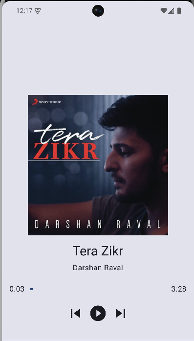
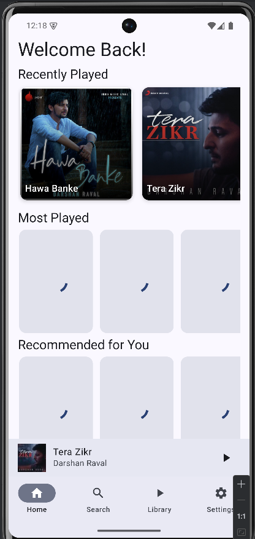
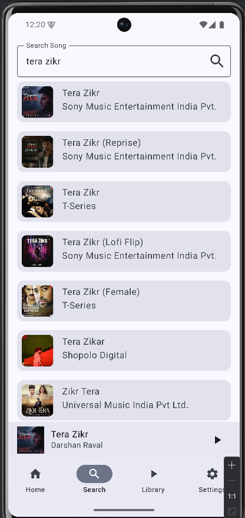

# TuneUp - Modern Android Music Player 🎵

TuneUp is a sleek, feature-rich music player application built for Android using Kotlin and Jetpack Compose. Experience your music with a modern Material 3 design, smooth animations, and intuitive controls.

## ✨ Features

- 🎵 Seamless music playback with precise controls
- 🎨 Modern Material 3 design language implementation
- 📱 Persistent mini-player with quick access controls
- 🖼️ Immersive full-screen player experience
- 📚 Comprehensive library management
- 🔍 Powerful music search functionality
- ⚙️ Customizable settings and preferences

## 🛠️ Tech Stack

- **Language**: Kotlin
- **UI Framework**: Jetpack Compose
- **Architecture**: MVVM (Model-View-ViewModel)
- **Navigation**: Jetpack Navigation Compose
- **Image Loading**: Coil 3
- **State Management**: Kotlin Flow & StateFlow

## 📱 Screenshots

## 🎯 Core Components

### Screens
- **Home**: Discover recommended and recent music
- **Search**: Find your favorite tracks quickly
- **Library**: Browse and manage your music collection
- **Settings**: Customize your app experience
- **Full Player**: Immersive music playback interface

### Key Features
- **MiniPlayer**
  - Persistent bottom player with current track info
  - Quick play/pause controls
  - Expandable to full-screen player
  - Artwork and track metadata display

- **Navigation**
  - Intuitive bottom navigation bar
  - Seamless integration with mini-player
  - Smooth screen transitions
