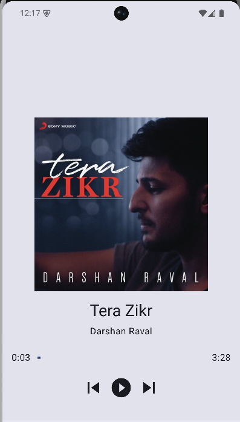
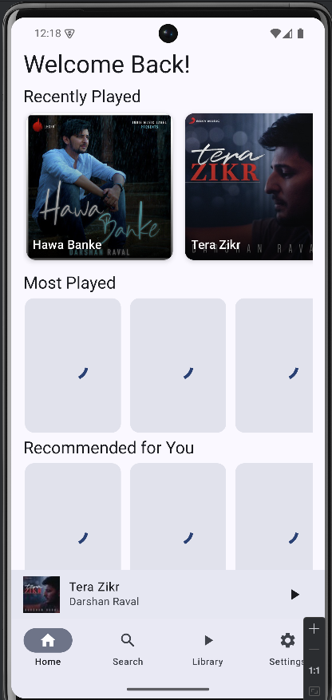
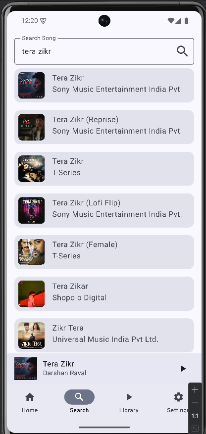

# TuneUp - Modern Android Music Player 🎵

TuneUp is a sleek, feature-rich music player application built for Android using Kotlin and Jetpack Compose. Experience your music with a modern Material 3 design, smooth animations, and intuitive controls.

## ✨ Features

- 🎵 Seamless music playback with precise controls
- 🎨 Modern Material 3 design language implementation
- 📱 Persistent mini-player with quick access controls
- 🖼️ Immersive full-screen player experience
- 📚 Comprehensive library management
- 🔍 Powerful music search functionality
- ⚙️ Customizable settings and preferences

## 🛠️ Tech Stack

- **Language**: Kotlin
- **UI Framework**: Jetpack Compose
- **Architecture**: MVVM (Model-View-ViewModel)
- **Navigation**: Jetpack Navigation Compose
- **Image Loading**: Coil 3
- **State Management**: Kotlin Flow & StateFlow

## 📱 Screenshots

[Place your screenshots here]



## 🚀 Getting Started

### Prerequisites

- Android Studio Arctic Fox or later
- Minimum SDK: Android 21 (Android 5.0)
- Target SDK: Android 34
- Kotlin version: 1.9.0 or later

### Installation

1. Clone the repository
```bash
git clone https://github.com/yourusername/tuneup.git
```

2. Open the project in Android Studio

3. Sync the project with Gradle files

4. Run the app on an emulator or physical device

## 🏗️ Project Structure

```
app/
├── src/
│   ├── main/
│   │   ├── java/
│   │   │   └── com/yourusername/tuneup/
│   │   │       ├── ui/
│   │   │       │   ├── screens/
│   │   │       │   ├── components/
│   │   │       │   └── theme/
│   │   │       ├── data/
│   │   │       ├── domain/
│   │   │       └── di/
│   │   └── res/
│   └── test/
└── build.gradle
```

## 🎯 Core Components

### Screens
- **Home**: Discover recommended and recent music
- **Search**: Find your favorite tracks quickly
- **Library**: Browse and manage your music collection
- **Settings**: Customize your app experience
- **Full Player**: Immersive music playback interface

### Key Features
- **MiniPlayer**
  - Persistent bottom player with current track info
  - Quick play/pause controls
  - Expandable to full-screen player
  - Artwork and track metadata display

- **Navigation**
  - Intuitive bottom navigation bar
  - Seamless integration with mini-player
  - Smooth screen transitions

## 🛠️ Building and Testing

```bash
# Build debug APK
./gradlew assembleDebug

# Run unit tests
./gradlew test

# Run instrumented tests
./gradlew connectedAndroidTest
```

## 🤝 Contributing

1. Fork the repository
2. Create your feature branch (`git checkout -b feature/AmazingFeature`)
3. Commit your changes (`git commit -m 'Add some AmazingFeature'`)
4. Push to the branch (`git push origin feature/AmazingFeature`)
5. Open a Pull Request

## 📄 License

This project is licensed under the MIT License - see the [LICENSE](LICENSE) file for details.

## 🙏 Acknowledgments

- Material Design 3 for the design system
- [List any other libraries or resources you used]

## 📱 Download

[Add Play Store link when available]

## 📞 Contact

Your Name - [@yourtwitter](https://twitter.com/yourtwitter) - email@example.com

Project Link: [https://github.com/yourusername/tuneup](https://github.com/yourusername/tuneup)
